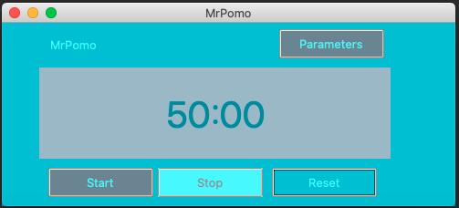
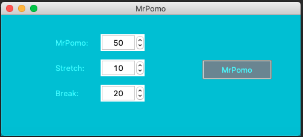
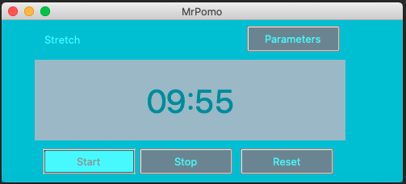
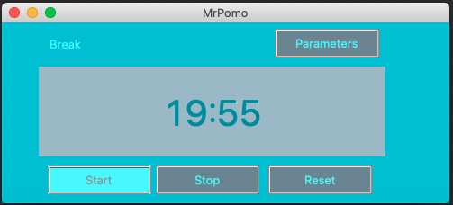

# MrPomo
Personal Project - Productivity Timer App for Desktop
-------------------------------

MrPomo is a Productivity Timer desktop application.
* Users will be able to customize intervals of Pomodoro time intervals

* Users will be able to start and stop timer as needed, as well as, rest the timer

{Stretch Screen}

{Break Screen}

## Built With
* [Python](https://www.python.org/)
* [Tkinter](https://wiki.python.org/moin/TkInter)
